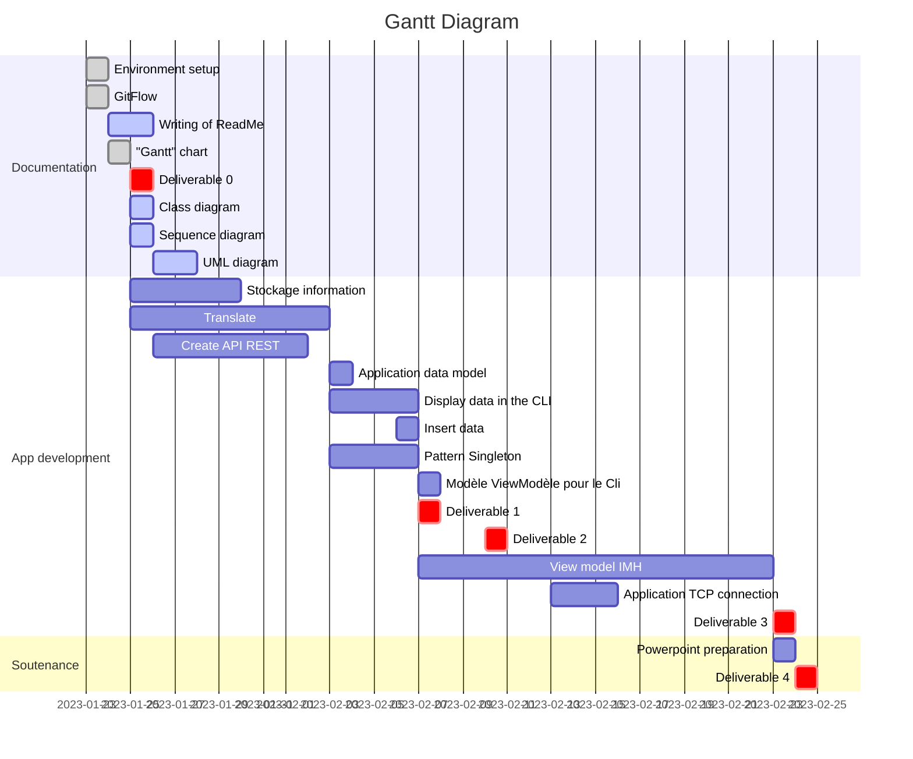
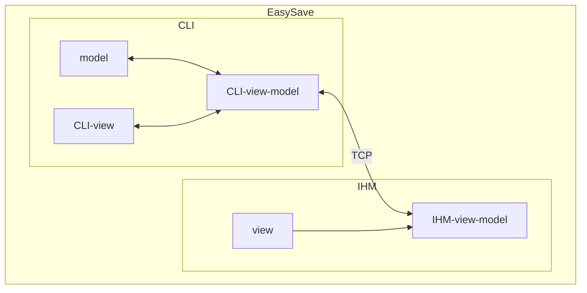
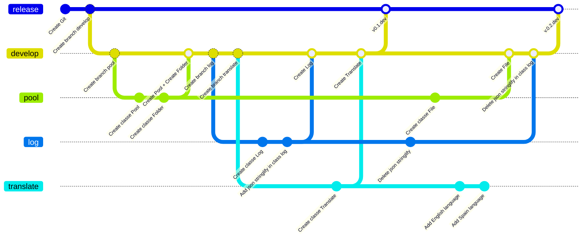
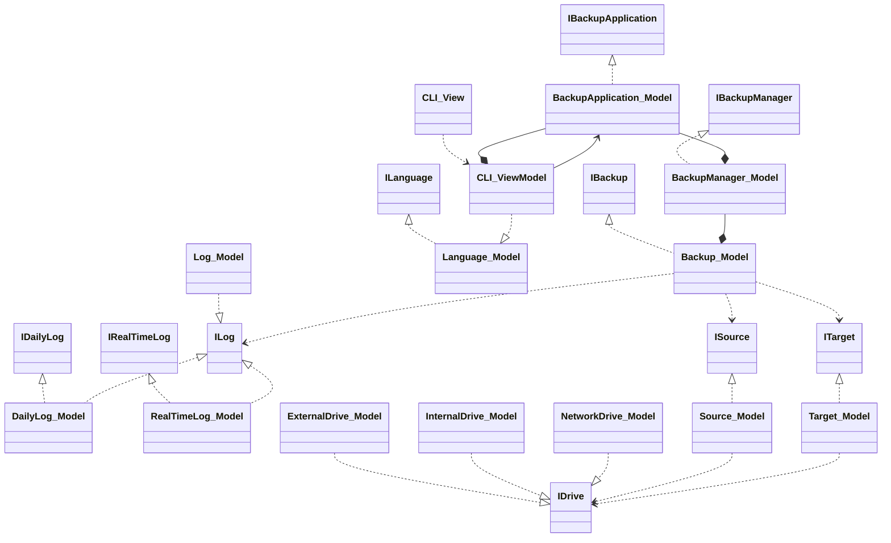
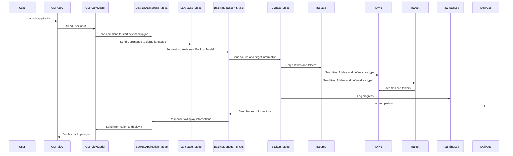

# EasySave

## App Description
The application we will develop and coded in ** C# ** with ** .net7.0. Its first version will be available only under console using .netCore. 
It will be necessary in this application to create jobs of simultaneous backups (5), by specifying a certain number of information. 
This application is available in two languages: English and French.
The software will be able to record the progress of the backup jobs. 

## Gantt chart



## Application MVVM-ClientServer architecture 

## Prerequisite 

- C# 
- .Net7.0
- At least Windows 7


## Installing the app

## GitFlow and Git connection 


Alternatively, you can also download the latest release from the releases page on the GitHub repository.
Our project is called EasySave. In order to keep the application running smoothly in simulation, we have set up a GIT repository. 
This one is accessible via the link below https://github.com/Francky46/EasySave.git to clone it to your project. 



## Application life cycle

### Pattern

X.Y–V : Version – Revision – Status
<table>
  <tr>
    <td>
      Status
    </td/>
    <td>
      Version
    </td/>
    <td>
      Description
    </td/>
  </tr>
  <tr>
    <td>
      dev
    </td/>
    <td>
      1.5-dev
    </td/>
    <td>
      Version under development. Usually used internally.
    </td/>
  </tr>
  <tr>
    <td>
      alpha
    </td/>
    <td>
      1.5-alpha
    </td/>
    <td>
      Version under development. Not all features are developed and may contain bugs. Generally used as POC (Proof Of Concept) to validate a general operation.
    </td/>
  </tr>
  <tr>
    <td>
      beta
    </td/>
    <td>
      1.5-beta
    </td/>
    <td>
      Version under development. Almost all features are developed and may contain bugs. Very used to make a first test pass in real conditions, especially in the context of beta private (number of users restricted).
    </td/>
  </tr>
  <tr>
    <td>
      release candidate
    </td/>
    <td>
      1.5-rc1
    </td/>
    <td>
      Version done. The features are all developed but may contain bugs that the RC aims to fix. There is often a versioning of RC (rc1, rc2, rc3, etc.).
    </td/>
  </tr>
  <tr>
    <td>
      release
    </td/>
    <td>
      1.5
    </td/>
    <td>
      Version completed and validated. The functionalities are all developed and considered stable (usable in production).
    </td/>
  </tr>
</table/>

### EasySave

<table>
  <tr>
    <td>
      Date
    </td>
    <td>
      Version
    </td>
    <td>
      Description
    </td>
  </tr>
  <tr>
    <td>
      24/01/2023
    </td>
    <td>
      0.1-dev
    </td>
    <td>
      Foundation of the application in . NET 7.0
    </td>
  </tr>
</table>

## CLI Application Diagrams

### Relations 
```mermaid
classDiagram
class Relation {
Type	Description
<|--	Inheritance
\*--	Composition
o--	Aggregation
-->	Association
--	Link (Solid)
..>	Dependency
..|>	Realization
"..	Link (Dashed)"
} 
```
### Simplified class diagram

<details>
<summary> Diagram explanation </summary>
This diagram describes a program architecture that uses interfaces to separate application layers.
There is an interface for each main class of the program, including IBackupApplication, IBackupManager, IBackup, IDailyLog, IRealTimeLog, ITarget, ISource, ILog and ILanguage. There are also concrete classes that implement these interfaces, such as BackupApplication_Model, BackupManager_Model, Backup_Model, DailyLog_Model, RealTimeLog_Model, Target_Model, Source_Model, Log_Model and Language_Model.

The CLI_View class is linked to the CLI_ViewModel class, which is used by the BackupApplication_Model class. The Log_Model class is linked to the ILog interface, while the CLI_ViewModel class is linked to the ILanguage interface. The Backup_Model class is linked to ILog, ISource and ITarget interfaces. The BackupManager_Model class has a composition relationship with the Backup_Model class. The BackupApplication_Model class has a composition relationship with the CLI_ViewModel and BackupManager_Model classes.
</details>

### Sequence diagram

## Commit convention 

Use an implement a naming convention to organize our committees and know at a glance which feature(s) is/are concerned. This convention will be of the form:

    Verb Subject @ File

With an action verb (update, upgrade, make, create, delete) followed by the subject of the commit (frontend, Ilog, schema, function that does...) and the files concerned (Programme.cs, ViewModel.cs)
Etablished a naming rule to organize our committees and make it easier to understand the features involved. This rule will be presented in the form of: Action subject @ files, with an action verb (update, improve, create, delete) followed by the subject of the commit (user interface, log system, schema, function) and the affected files (Programme.cs, ViewModel.cs).


## Naming conventions 

There are several naming conventions to consider when writing C# code.

In the following examples, any of the guidance pertaining to elements marked public is also applicable when working with protected and protected internal elements, all of which are intended to be visible to external callers.

### Pascal case
Use pascal casing ("PascalCasing") when naming a class, record, or struct.

```C#
public class DataService
{
}

public record PhysicalAddress(
    string Street,
    string City,
    string StateOrProvince,
    string ZipCode);

public struct ValueCoordinate
{

}
```
When naming an interface, use pascal casing in addition to prefixing the name with an I. This clearly indicates to consumers that it's an interface.
```C#
public interface IWorkerQueue
{
}
```
When naming public members of types, such as fields, properties, events, methods, and local functions, use pascal casing.
```C#
public class ExampleEvents
{
    // A public field, these should be used sparingly
    public bool IsValid;

    // An init-only property
    public IWorkerQueue WorkerQueue { get; init; }

    // An event
    public event Action EventProcessing;

    // Method
    public void StartEventProcessing()
    {
        // Local function
        static int CountQueueItems() => WorkerQueue.Count;
        // ...
    }
}
```
When writing positional records, use pascal casing for parameters as they're the public properties of the record.
```C#
public record PhysicalAddress(
    string Street,
    string City,
    string StateOrProvince,
    string ZipCode);
```
For more information on positional records, see Positional syntax for property definition.

### Camel case
Use camel casing ("camelCasing") when naming private or internal fields, and prefix them with _.
```C#
public class DataService
{
    private IWorkerQueue _workerQueue;
}
```
>Tip
>When editing C# code that follows these naming conventions in an IDE that supports statement completion, typing _ will show all of the object-scoped members.

When working with static fields that are private or internal, use the s_ prefix and for thread static use t_.
```C#
public class DataService
{
    private static IWorkerQueue s_workerQueue;

    [ThreadStatic]
    private static TimeSpan t_timeSpan;
}
```
When writing method parameters, use camel casing.
```C#
public T SomeMethod<T>(int someNumber, bool isValid)
{

}
```
For more information on C# naming conventions, see C# Coding Style.

## Additional naming conventions
Examples that don't include using directives, use namespace qualifications. If you know that a namespace is imported by default in a project, you don't have to fully qualify the names from that namespace. Qualified names can be broken after a dot (.) if they are too long for a single line, as shown in the following example.
```C#
var currentPerformanceCounterCategory = new System.Diagnostics.
    PerformanceCounterCategory();
```   
You don't have to change the names of objects that were created by using the Visual Studio designer tools to make them fit other guidelines.

## Layout conventions
Good layout uses formatting to emphasize the structure of your code and to make the code easier to read. Microsoft examples and samples conform to the following conventions:

Use the default Code Editor settings (smart indenting, four-character indents, tabs saved as spaces). For more information, see Options, Text Editor, C#, Formatting.

Write only one statement per line.

Write only one declaration per line.

If continuation lines are not indented automatically, indent them one tab stop (four spaces).

Add at least one blank line between method definitions and property definitions.

Use parentheses to make clauses in an expression apparent, as shown in the following code.
```C#
if ((val1 > val2) && (val1 > val3))
{
    // Take appropriate action.
}
```
## Commenting conventions
- Place the comment on a separate line, not at the end of a line of code.
- Begin comment text with an uppercase letter.
- End comment text with a period.
- Insert one space between the comment delimiter (//) and the comment text, as shown in the following example.
```C#
// The following declaration creates a query. It does not run
// the query.
```
Don't create formatted blocks of asterisks around comments.

Ensure all public members have the necessary XML comments providing appropriate descriptions about their behavior.

## Language guidelines
The following sections describe practices that the C# team follows to prepare code examples and samples.

### String data type
Use string interpolation to concatenate short strings, as shown in the following code.

string displayName = $"{nameList[n].LastName}, {nameList[n].FirstName}";
To append strings in loops, especially when you're working with large amounts of text, use a StringBuilder object.
```C#
var phrase = "lalalalalalalalalalalalalalalalalalalalalalalalalalalalalala";
var manyPhrases = new StringBuilder();
for (var i = 0; i < 10000; i++)
{
    manyPhrases.Append(phrase);
}
//Console.WriteLine("tra" + manyPhrases);
```
### Implicitly typed local variables
- Use implicit typing for local variables when the type of the variable is obvious from the right side of the assignment, or when the precise type is not important.
```C#
var var1 = "This is clearly a string.";
var var2 = 27;
```
- Don't use var when the type is not apparent from the right side of the assignment. Don't assume the type is clear from a method name. A variable type is considered clear if it's a new operator or an explicit cast.
```C#
int var3 = Convert.ToInt32(Console.ReadLine()); 
int var4 = ExampleClass.ResultSoFar();
```
- Don't rely on the variable name to specify the type of the variable. It might not be correct. In the following example, the variable name inputInt is misleading. It's a string.
```C#
var inputInt = Console.ReadLine();
Console.WriteLine(inputInt);
```
- Avoid the use of var in place of dynamic. Use dynamic when you want run-time type inference. For more information, see Using type dynamic (C# Programming Guide).
- Use implicit typing to determine the type of the loop variable in for loops.

The following example uses implicit typing in a for statement.
```C#
var phrase = "lalalalalalalalalalalalalalalalalalalalalalalalalalalalalala";
var manyPhrases = new StringBuilder();
for (var i = 0; i < 10000; i++)
{
    manyPhrases.Append(phrase);
}
//Console.WriteLine("tra" + manyPhrases);
```
- Don't use implicit typing to determine the type of the loop variable in foreach loops. In most cases, the type of elements in the collection isn't immediately obvious. The collection's name shouldn't be solely relied upon for inferring the type of its elements.

The following example uses explicit typing in a foreach statement.
```C#
foreach (char ch in laugh)
{
    if (ch == 'h')
        Console.Write("H");
    else
        Console.Write(ch);
}
Console.WriteLine();
```
>Note
>Be careful not to accidentally change a type of an element of the iterable collection. For example, it is easy to switch from System.Linq.IQueryable to >System.Collections.IEnumerable in a foreach statement, which changes the execution of a query.

### Unsigned data types
In general, use int rather than unsigned types. The use of int is common throughout C#, and it is easier to interact with other libraries when you use int.

### Arrays
Use the concise syntax when you initialize arrays on the declaration line. In the following example, note that you can't use var instead of string[].
```C#
string[] vowels1 = { "a", "e", "i", "o", "u" };
```
If you use explicit instantiation, you can use var.
```C#
var vowels2 = new string[] { "a", "e", "i", "o", "u" };
```
### Delegates
Use Func<> and Action<> instead of defining delegate types. In a class, define the delegate method.
```C#
public static Action<string> ActionExample1 = x => Console.WriteLine($"x is: {x}");

public static Action<string, string> ActionExample2 = (x, y) => 
    Console.WriteLine($"x is: {x}, y is {y}");

public static Func<string, int> FuncExample1 = x => Convert.ToInt32(x);

public static Func<int, int, int> FuncExample2 = (x, y) => x + y;
```
Call the method using the signature defined by the Func<> or Action<> delegate.
```C#
ActionExample1("string for x");

ActionExample2("string for x", "string for y");

Console.WriteLine($"The value is {FuncExample1("1")}");

Console.WriteLine($"The sum is {FuncExample2(1, 2)}");
```
If you create instances of a delegate type, use the concise syntax. In a class, define the delegate type and a method that has a matching signature.
```C#
public delegate void Del(string message);

public static void DelMethod(string str)
{
    Console.WriteLine("DelMethod argument: {0}", str);
}
```
Create an instance of the delegate type and call it. The following declaration shows the condensed syntax.
```C#
Del exampleDel2 = DelMethod;
exampleDel2("Hey");
```
The following declaration uses the full syntax.
```C#
Del exampleDel1 = new Del(DelMethod);
exampleDel1("Hey");
```

### try-catch and using statements in exception handling
Use a try-catch statement for most exception handling.
```C#
static string GetValueFromArray(string[] array, int index)
{
    try
    {
        return array[index];
    }
    catch (System.IndexOutOfRangeException ex)
    {
        Console.WriteLine("Index is out of range: {0}", index);
        throw;
    }
}
```
Simplify your code by using the C# using statement. If you have a try-finally statement in which the only code in the finally block is a call to the Dispose method, use a using statement instead.

In the following example, the try-finally statement only calls Dispose in the finally block.
```C#
Font font1 = new Font("Arial", 10.0f);
try
{
    byte charset = font1.GdiCharSet;
}
finally
{
    if (font1 != null)
    {
        ((IDisposable)font1).Dispose();
    }
}
```
You can do the same thing with a using statement.
```C#
using (Font font2 = new Font("Arial", 10.0f))
{
    byte charset2 = font2.GdiCharSet;
}
```
Use the new using syntax that doesn't require braces:
```C#
using Font font3 = new Font("Arial", 10.0f);
byte charset3 = font3.GdiCharSet;
```
### && and || operators
To avoid exceptions and increase performance by skipping unnecessary comparisons, use && instead of & and || instead of | when you perform comparisons, as shown in the following example.
```C#
Console.Write("Enter a dividend: ");
int dividend = Convert.ToInt32(Console.ReadLine());

Console.Write("Enter a divisor: ");
int divisor = Convert.ToInt32(Console.ReadLine());

if ((divisor != 0) && (dividend / divisor > 0))
{
    Console.WriteLine("Quotient: {0}", dividend / divisor);
}
else
{
    Console.WriteLine("Attempted division by 0 ends up here.");
}
```
If the divisor is 0, the second clause in the if statement would cause a run-time error. But the && operator short-circuits when the first expression is false. That is, it doesn't evaluate the second expression. The & operator would evaluate both, resulting in a run-time error when divisor is 0.

###new operator
Use one of the concise forms of object instantiation, as shown in the following declarations. The second example shows syntax that is available starting in C# 9.
```C#
var instance1 = new ExampleClass();

ExampleClass instance2 = new();
```
The preceding declarations are equivalent to the following declaration.
```C#
ExampleClass instance2 = new ExampleClass();
```
Use object initializers to simplify object creation, as shown in the following example.
```C#
var instance3 = new ExampleClass { Name = "Desktop", ID = 37414,
    Location = "Redmond", Age = 2.3 };
```
The following example sets the same properties as the preceding example but doesn't use initializers.
```C#
var instance4 = new ExampleClass();
instance4.Name = "Desktop";
instance4.ID = 37414;
instance4.Location = "Redmond";
instance4.Age = 2.3;
```
### Event handling
If you're defining an event handler that you don't need to remove later, use a lambda expression.
```C#
public Form2()
{
    this.Click += (s, e) =>
        {
            MessageBox.Show(
                ((MouseEventArgs)e).Location.ToString());
        };
}
```
The lambda expression shortens the following traditional definition.
```C#
public Form1()
{
    this.Click += new EventHandler(Form1_Click);
}

void Form1_Click(object? sender, EventArgs e)
{
    MessageBox.Show(((MouseEventArgs)e).Location.ToString());
}
```
### Static members
Call static members by using the class name: ClassName.StaticMember. This practice makes code more readable by making static access clear. Don't qualify a static member defined in a base class with the name of a derived class. While that code compiles, the code readability is misleading, and the code may break in the future if you add a static member with the same name to the derived class.

### LINQ queries

Use meaningful names for query variables. The following example uses seattleCustomers for customers who are located in Seattle.
```C#
var seattleCustomers = from customer in customers
                       where customer.City == "Seattle"
                       select customer.Name;
```
Use aliases to make sure that property names of anonymous types are correctly capitalized, using Pascal casing.
```C#
var localDistributors =
    from customer in customers
    join distributor in distributors on customer.City equals distributor.City
    select new { Customer = customer, Distributor = distributor };
```
Rename properties when the property names in the result would be ambiguous. For example, if your query returns a customer name and a distributor ID, instead of leaving them as Name and ID in the result, rename them to clarify that Name is the name of a customer, and ID is the ID of a distributor.
```C#
var localDistributors2 =
    from customer in customers
    join distributor in distributors on customer.City equals distributor.City
    select new { CustomerName = customer.Name, DistributorID = distributor.ID };
```
Use implicit typing in the declaration of query variables and range variables.
```C#
var seattleCustomers = from customer in customers
                       where customer.City == "Seattle"
                       select customer.Name;
```
Align query clauses under the from clause, as shown in the previous examples.

Use where clauses before other query clauses to ensure that later query clauses operate on the reduced, filtered set of data.
```C#
var seattleCustomers2 = from customer in customers
                        where customer.City == "Seattle"
                        orderby customer.Name
                        select customer;
```
Use multiple from clauses instead of a join clause to access inner collections. For example, a collection of Student objects might each contain a collection of test scores. When the following query is executed, it returns each score that is over 90, along with the last name of the student who received the score.
```C#
var scoreQuery = from student in students
                 from score in student.Scores!
                 where score > 90
                 select new { Last = student.LastName, score };
```

## Secure coding guidelines
Most application code can simply use the infrastructure implemented by .NET. In some cases, additional application-specific security is required, built either by extending the security system or by using new ad hoc methods.

Using .NET enforced permissions and other enforcement in your code, you should erect barriers to prevent malicious code from accessing information that you don't want it to have or performing other undesirable actions. Additionally, you must strike a balance between security and usability in all the expected scenarios using trusted code.

This overview describes the different ways code can be designed to work with the security system.

###Securing resource access
When designing and writing your code, you need to protect and limit the access that code has to resources, especially when using or invoking code of unknown origin. So, keep in mind the following techniques to ensure your code is secure:

- Do not use Code Access Security (CAS).
- Do not use partial trusted code.
- Do not use the AllowPartiallyTrustedCaller attribute (APTCA).
- Do not use .NET Remoting.
- Do not use Distributed Component Object Model (DCOM).
- Do not use binary formatters.

Code Access Security and Security-Transparent Code are not supported as a security boundary with partially trusted code. We advise against loading and executing code of unknown origins without putting alternative security measures in place. The alternative security measures are:

- Virtualization
- AppContainers
- Operating system (OS) users and permissions
- Hyper-V containers

### Security-neutral code
Security-neutral code does nothing explicit with the security system. It runs with whatever permissions it receives. Although applications that fail to catch security exceptions associated with protected operations (such as using files, networking, and so on) can result in an unhandled exception, security-neutral code still takes advantage of the security technologies in .NET.

A security-neutral library has special characteristics that you should understand. Suppose your library provides API elements that use files or call unmanaged code. If your code doesn't have the corresponding permission, it won't run as described. However, even if the code has the permission, any application code that calls it must have the same permission in order to work. If the calling code doesn't have the right permission, a SecurityException appears as a result of the code access security stack walk.

### Application code that isn't a reusable component
If your code is part of an application that won't be called by other code, security is simple and special coding might not be required. However, remember that malicious code can call your code. While code access security might stop malicious code from accessing resources, such code could still read values of your fields or properties that might contain sensitive information.

Additionally, if your code accepts user input from the Internet or other unreliable sources, you must be careful about malicious input.

### Managed wrapper to native code implementation
Typically in this scenario, some useful functionality is implemented in native code that you want to make available to managed code. Managed wrappers are easy to write using either platform invoke or COM interop. However, if you do this, callers of your wrappers must have unmanaged code rights in order to succeed. Under default policy, this means that code downloaded from an intranet or the Internet won't work with the wrappers.

Instead of giving unmanaged code rights to all applications that use these wrappers, it's better to give these rights only to the wrapper code. If the underlying functionality exposes no resources and the implementation is likewise safe, the wrapper only needs to assert its rights, which enables any code to call through it. When resources are involved, security coding should be the same as the library code case described in the next section. Because the wrapper is potentially exposing callers to these resources, careful verification of the safety of the native code is necessary and is the wrapper's responsibility.

### Library code that exposes protected resources
The following approach is the most powerful and hence potentially dangerous (if done incorrectly) for security coding: your library serves as an interface for other code to access certain resources that aren't otherwise available, just as the .NET classes enforce permissions for the resources they use. Wherever you expose a resource, your code must first demand the permission appropriate to the resource (that is, it must perform a security check) and then typically assert its rights to perform the actual operation.

